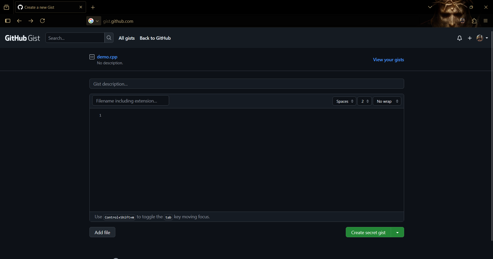
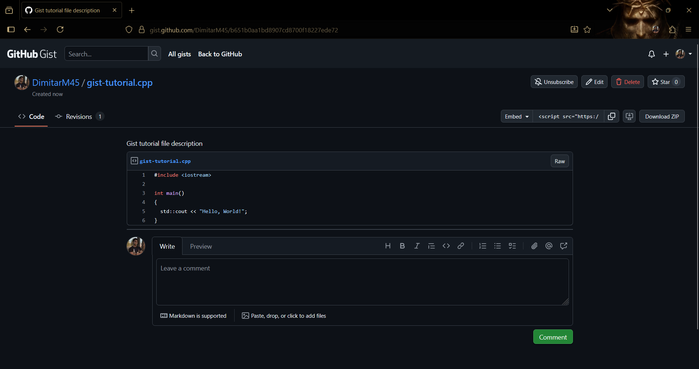
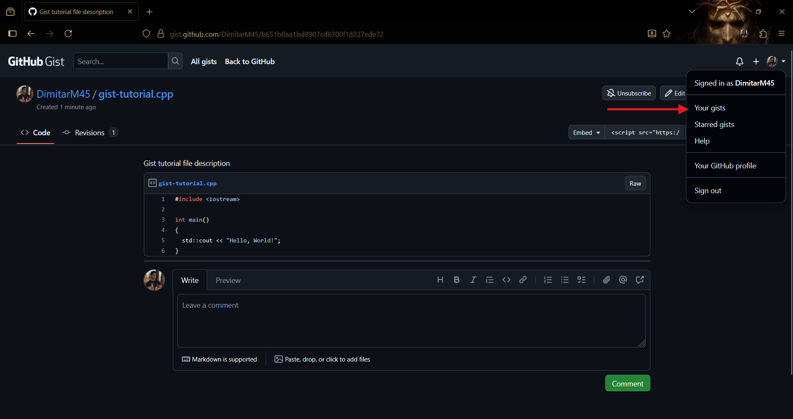

## Създаване на Github gist

Github gist ви предоставя възможността да създавате публични (или "secret", достъпни само през линк) code snippet-и, дори без да имате акаунт в Github. Според нас Github repository-тата са по-важни за усвояване, но НЕ са част от курса. Съответно, ако имате затруднения с тях, преспокойно може да използвате Github gist-ове, за да ни изпращате решенията си! 

**Как да създадем gist?**
Отивате на [gist.github.com](http://gist.github.com)

В полето "Gist description" може да добавите описание на вашия gist (номер/тема на упражнение, за които са задачите например). В полето "Filename including extension..." въвеждате името на вашия файл. **Името на файла ви трябва да завършва на .cpp!**. От бутона "Add file" може да добавите допълнителни файлове във вашия gist (по един за всяка задача например). 

Накрая кликвате "Create secret gist" като тук имате две опции:
1. Create secret gist - Тези gist-ове са скрити от търсачки и могат да бъдат достъпени само през линка на gist-а (след като го създадете).
2. Create public gist - Тези gist-ове могат да бъдат намерени както през търсачка, така и достъпени през линка на gist-а.

**Ако НЯМАТЕ акаунт в Github, вашите gist-ове ще са анонимни! С други думи, ако изгубите линка и са secret, няма да можете да ги намерите/достъпите! Ако са public и изгубите линка, ще са достъпни само, ако помните името на файла (и го откриете в резултати от някоя търсачка :D).**

**Ако имате акаунт в Github, всичко става много по-лесно. Вашите gist-ове се пазят в акаунта ви и могат да бъдат достъпени от тук:**

Разбира се, ако имате нужда от помощ винаги сме насреща! :)
