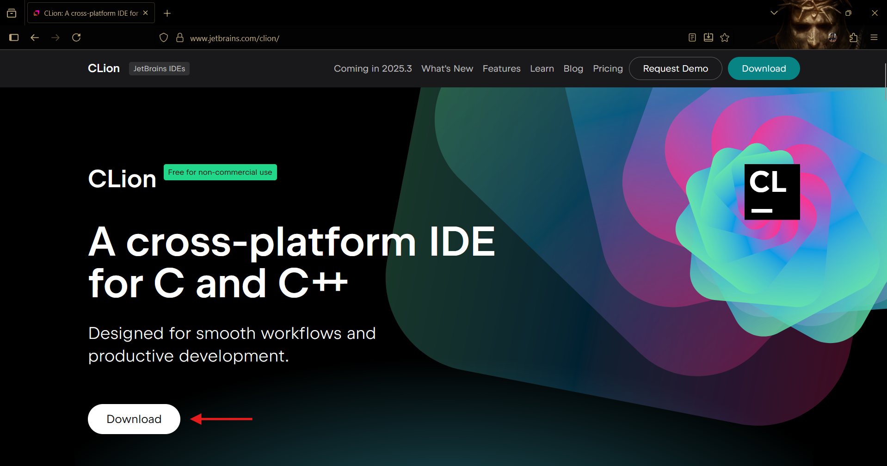
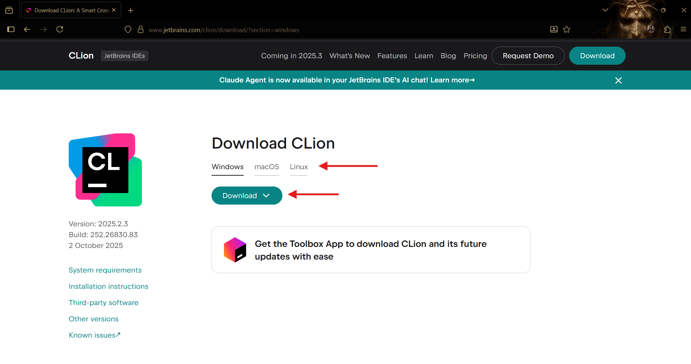
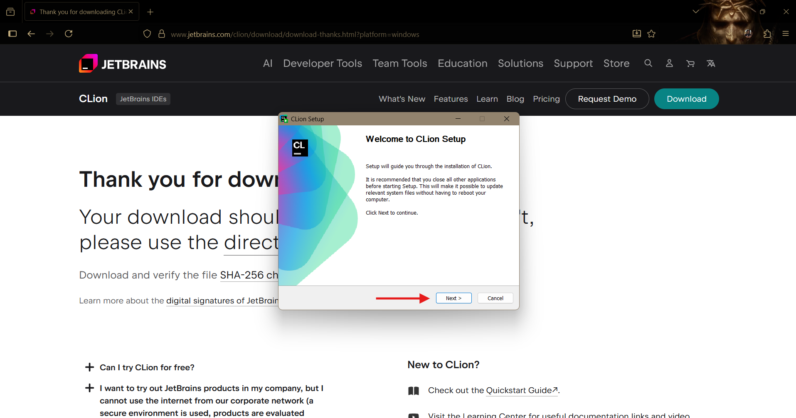
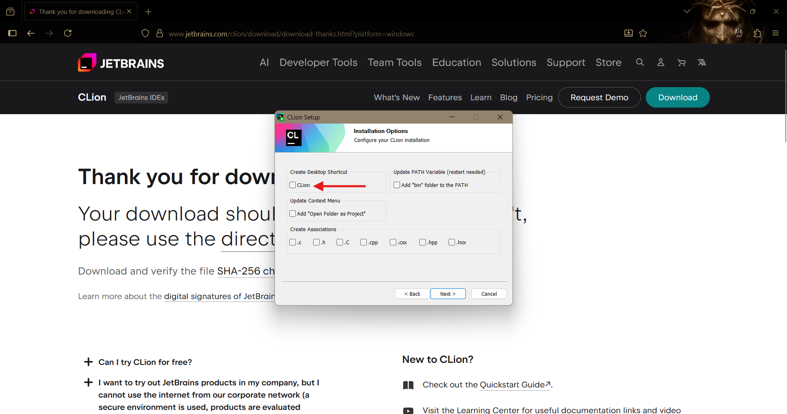
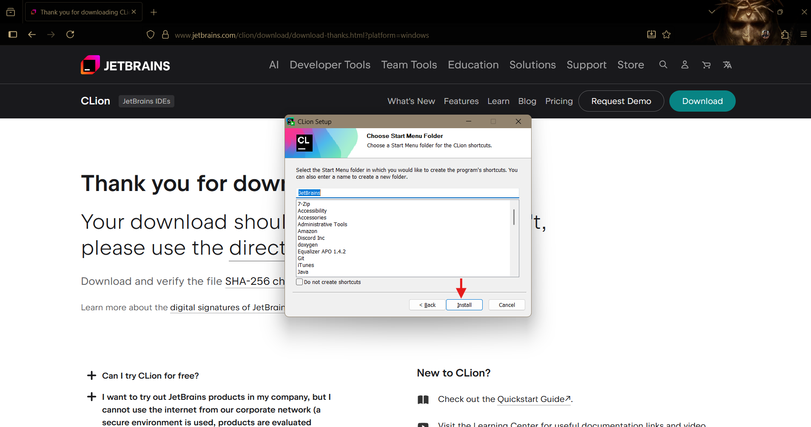
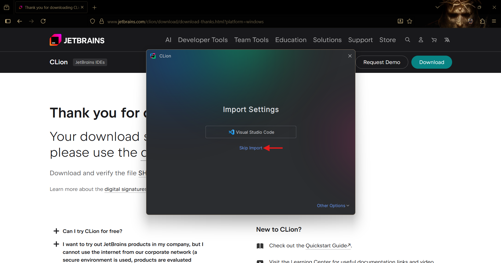
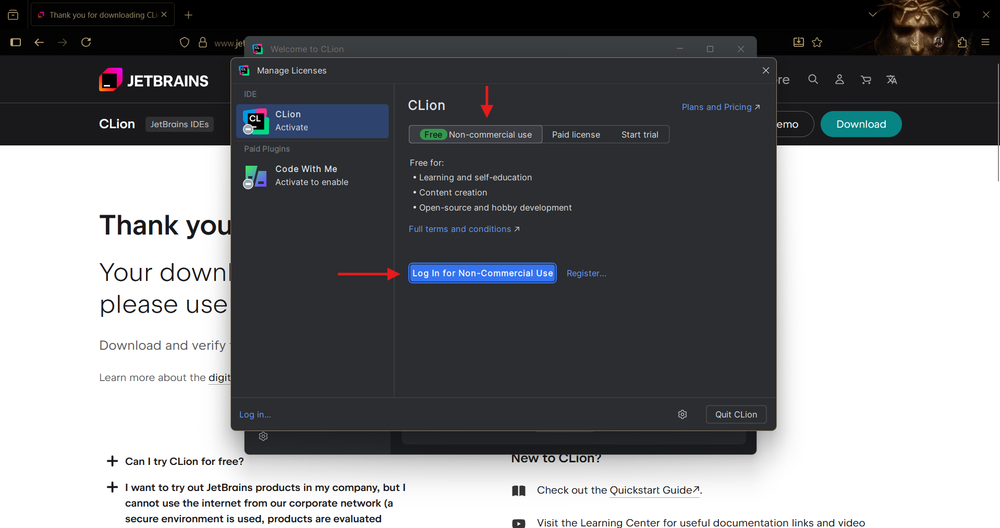
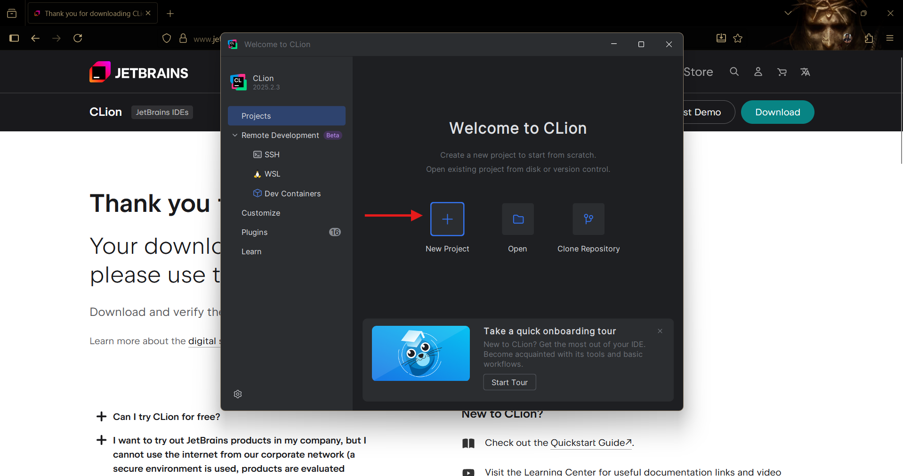
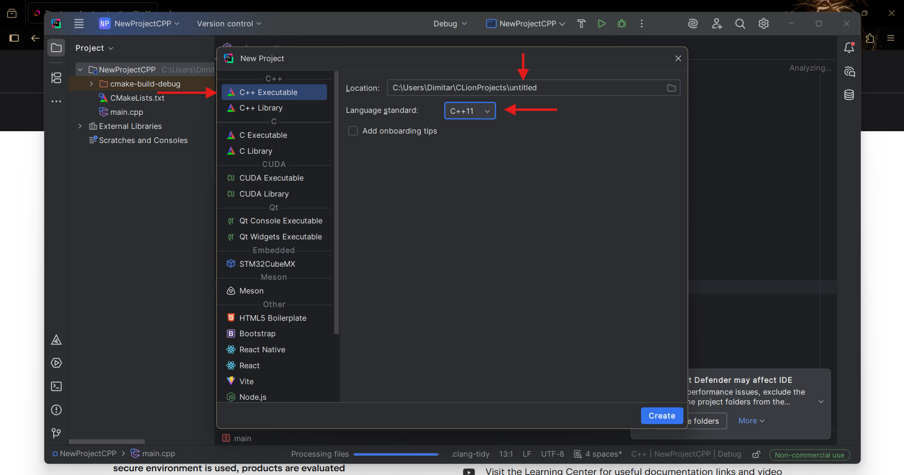
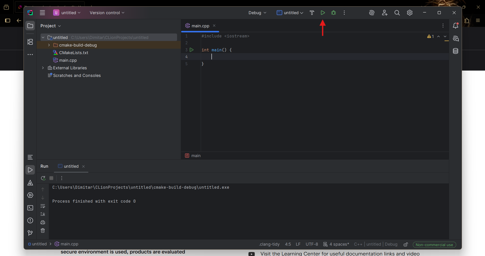

# Работа със CLion (Windows, Linux, Mac)
**Ако сте на Windows, ви препоръчваме да използвате Visual Studio! :)**
## 1. Инсталация

За да си инсталирате CLion, кликвате [тук](https://www.jetbrains.com/clion/).

Избирате версията за вашата операционна система, изтегляте инсталационния файл и го отваряте.

Следвате стъпките в инсталационната програма.

Маркирате желаните опции (ако не сте сигурни за останалите, изберете само "Create Desktop Shortcut"), след което кликвате "Next".

След това кликвате "Install".

При първото отваряне на CLion след инсталацията ще трябва да приемете условията на използване. Ако искате да копирате настройките си от друг code editor/IDE, избирате програмата, която желаете. В противен случай кликвате "Skip Import".

Отново, при първото отваряне след инсталацията ще бъдете попитани за лиценз за използване. Избирате "Free Non-commercial use". След това влизате в акаунта си (първо се регистрирате, ако нямате такъв). **Безплатният ви лиценз е активен за една година.**

## 2. Създаване на файл/проект

За да създадете нов проект кликвате "New Project".

Избирате C++ Executable. В полето "Location" след последната "\\" пишете името на вашия проект. Избирате C++11 **(Курсът се води на тази версия на езика)** и натискате "Create".

Вече имате готов проект! Може да стартирате програмата си от зеления бутон "Run".

Разбира се, ако имате нужда от помощ винаги сме насреща! :)
