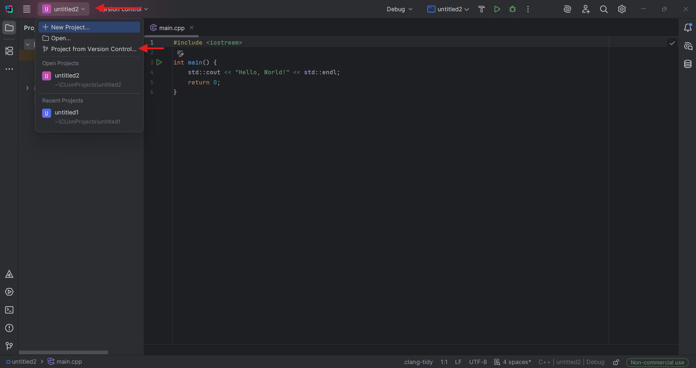
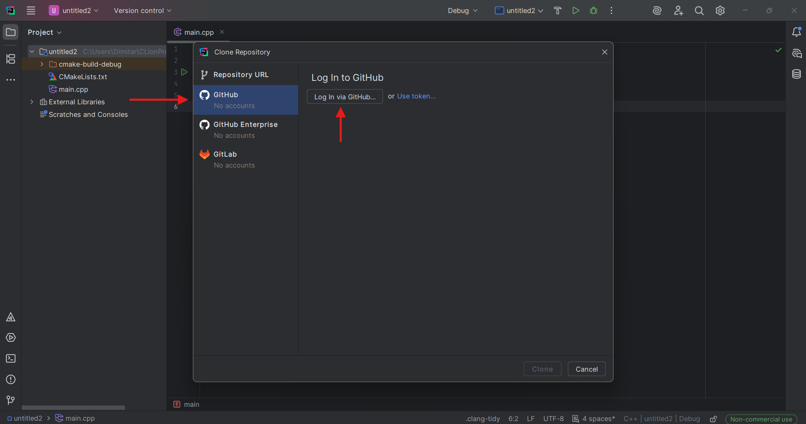
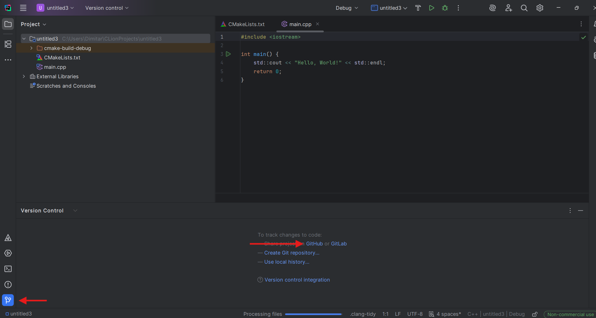
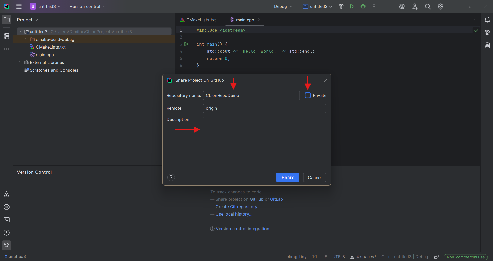
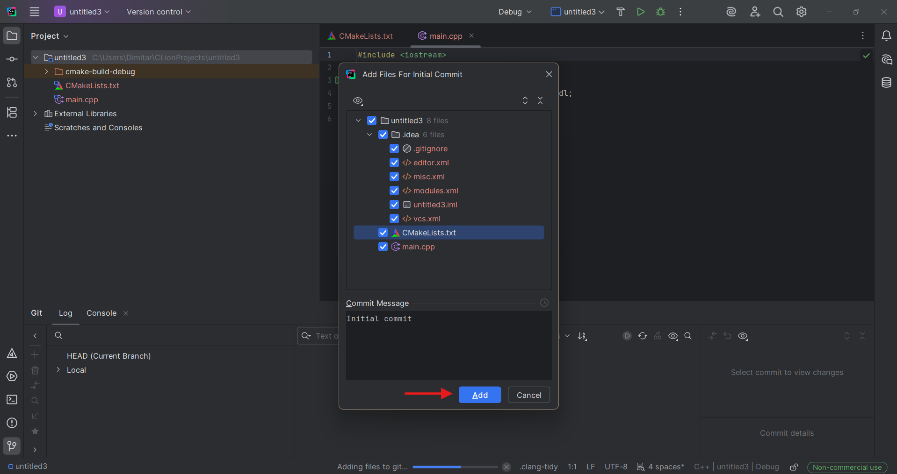
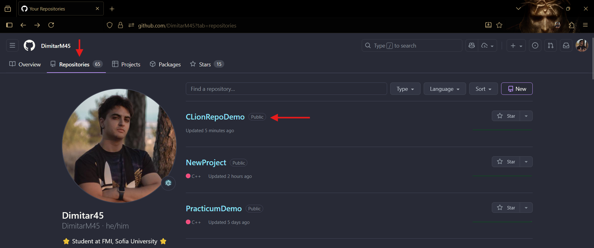
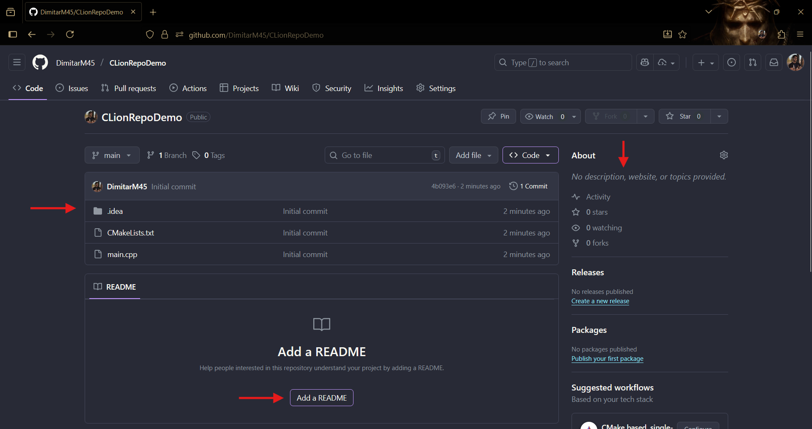

# Работа със CLion (Windows, Linux, Mac)
**Ако сте на Windows, ви препоръчваме да използвате Visual Studio! :)**
## 1. Инсталация

За да си инсталирате CLion, кликвате [тук](https://www.jetbrains.com/clion/).

Избирате версията за вашата операционна система, изтегляте инсталационния файл и го отваряте.

Следвате стъпките в инсталационната програма.

Маркирате желаните опции (ако не сте сигурни за останалите, изберете само "Create Desktop Shortcut"), след което кликвате "Next".

След това кликвате "Install".

При първото отваряне на CLion след инсталацията ще трябва да приемете условията на използване. Ако искате да копирате настройките си от друг code editor/IDE, избирате програмата, която желаете. В противен случай кликвате "Skip Import".

Отново, при първото отваряне след инсталацията ще бъдете попитани за лиценз за използване. Избирате "Free Non-commercial use". След това влизате в акаунта си (първо се регистрирате, ако нямате такъв). **Безплатният ви лиценз е активен за една година.**

## 2. Създаване на файл/проект

За да създадете нов проект кликвате "New Project".

Избирате C++ Executable. В полето "Location" след последната "\\" пишете името на вашия проект. Избирате C++11 **(Курсът се води на тази версия на езика)** и натискате "Create".

Вече имате готов проект! Може да стартирате програмата си от зеления бутон "Run".

## 3. Създаване и качване на repository в Github

За да създадете и качите Github repository, кликвате на името на вашия проект и избирате "Project from Version Control...". 

Избирате "Github" и си влизате в акаунта.

Кликвате "Version Control" и след това кликвате Github.

Когато се отвори прозореца, имате следните опции:

1. Име на вашето repository (полето Repository name)
2. **ВАЖНО: НЕ МАРКИРАЙТЕ КУТИЙКАТА "PRIVATE". REPOSITORY-ТО ТРЯБВА ДА Е ПУБЛИЧНО, ЗА ДА ГО ВИЖДАМЕ КАТО НИ ИЗПРАТИТЕ ЛИНК.**
3. Описание на вашето repository (полето Description - не е задължително)

Накрая кликвате "Share".

В следващия прозорец избирате всички файлове (по подразбиране са избрани всички) и кликвате "Add".

Вече имате Github repository! Може да го достъпите от страницата на вашия профил -> "Repositories".

В страницата на вашето repository се намират файловете, които сте качили през CLion. Вдясно може да видите и промените (ако желаете) description-а, а най-отдолу може да създадете README.md файл. Той се визуализира на страницата на вашето repository и в него може да добавяте информация за repository-то (например тема/номер на упражнение, за което качвате решенията). Не е задължителен, но би ни улеснил при проверяване на решенията ви :).

**Ако нямате опит с git ви препоръчваме да качвате вашите repository-та СЛЕД като сте си решили задачите (т.е., когато няма да редактирате файловете повече), за да не се занимавате с commit-и.**

**За да ни изпратите кода си, просто копирате линка на страницата на вашето repository и ни го изпращате на лично съобщение.**

**За тези, на които им е по-трудно с Github repository-та има и [gist tutorial](../../Gist/Gist-tutorial.md)!**

Разбира се, ако имате нужда от помощ винаги сме насреща! :)
