# Работа с Visual Studio (препоръчваме за Windows)
## 1. Инсталация:

За да си инсталирате Visual Studio кликвате [тук](https://visualstudio.microsoft.com/) и след това "Download Visual Studio". Отворете инсталационния файл, когато се изтегли. Когато се отвори кликвате "Continue".

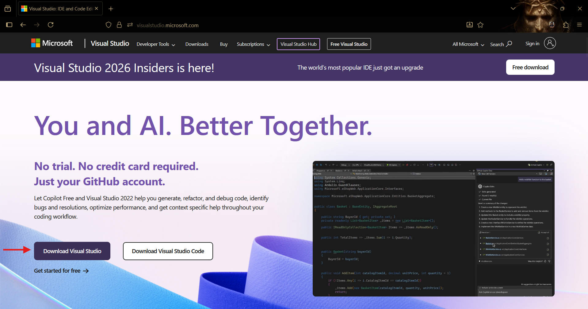
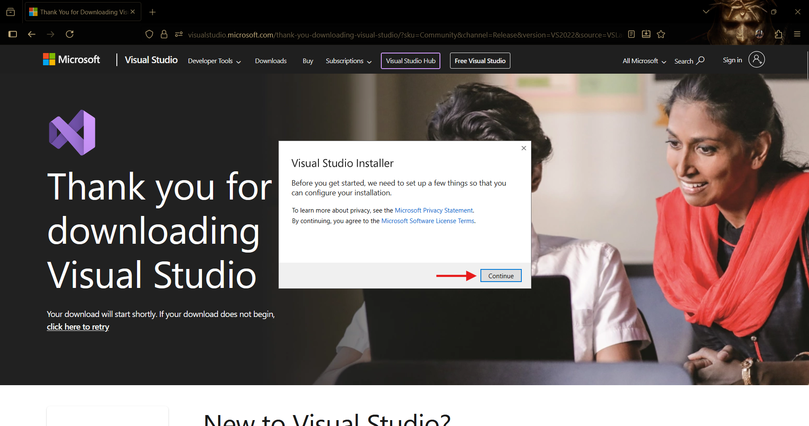

Скролвате и избирате "Desktop development with C++". След това кликвате "Install".

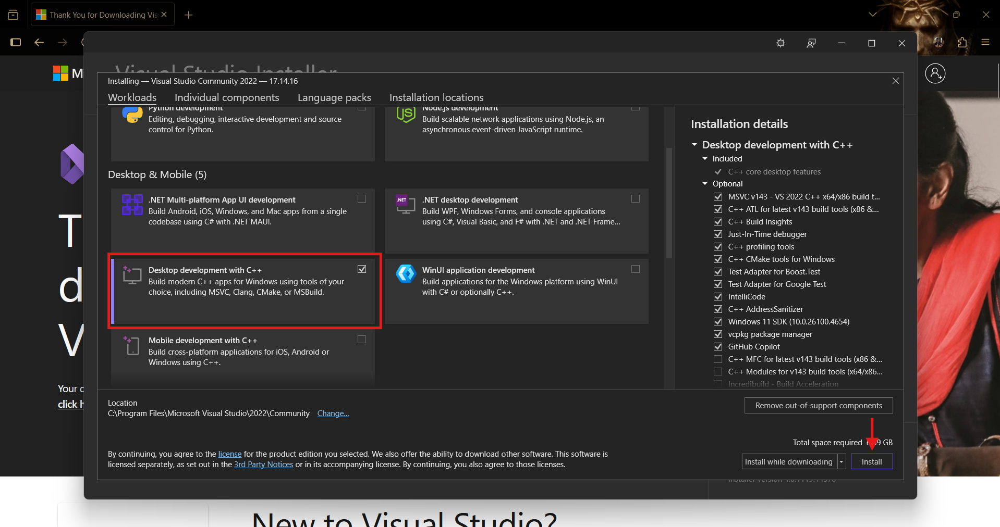

След инсталацията може да го отворите от Windows Start Menu-то.

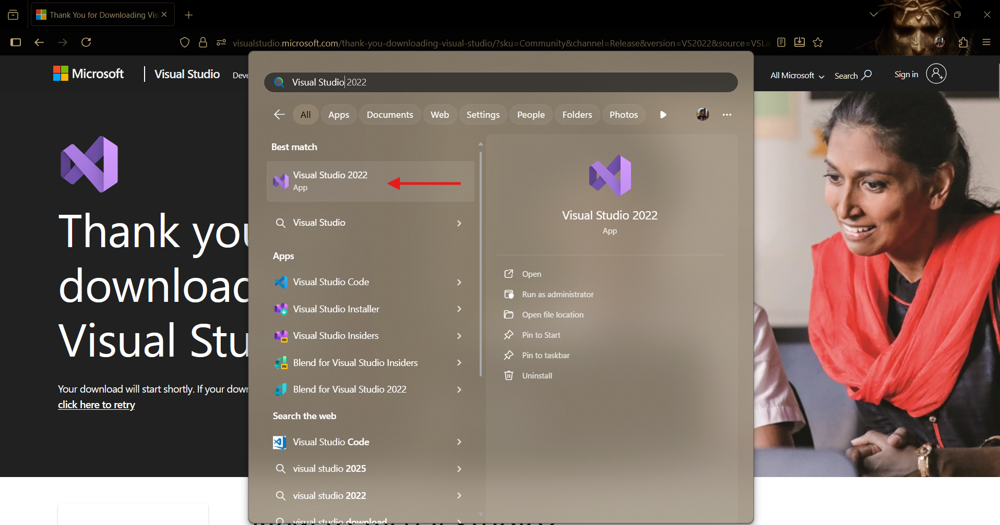

Ако вече имате акаунт в Github може с него да влезете. Ако нямате такъв, просто кликнете "Skip and add accounts later.".

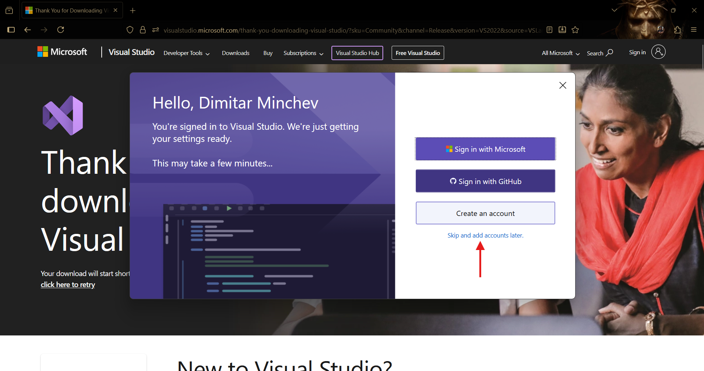

## 2. Създаване на файл/проект 

Когато отворите Visual Studio, кликвате "Create a new project".

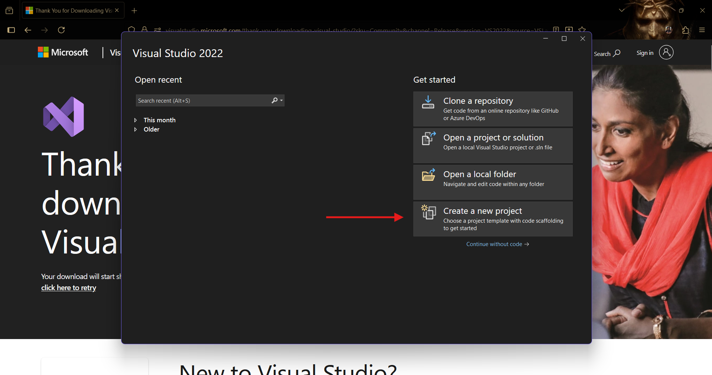

В търсачката пишете "Console App", избирате Console App със C++ и кликвате "Next".

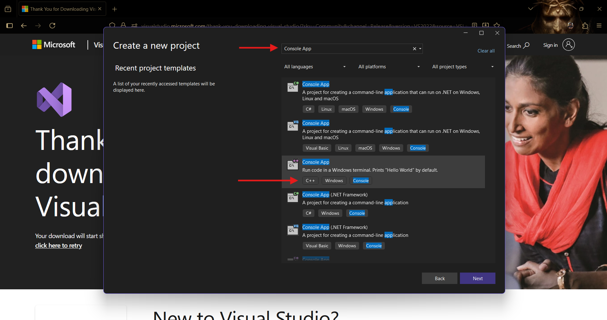

Задавате име на вашия проект, избирате "Place solution and project in the same directory" и кликвате "Create".

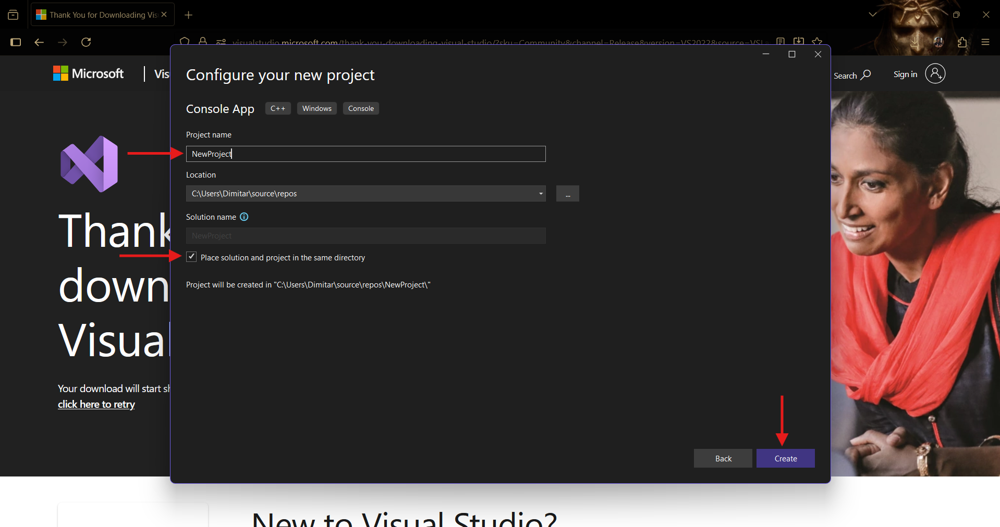

Вече имате готов проект! Може да стартирате програмата си от зеления бутон (или просто Ctrl-F5).

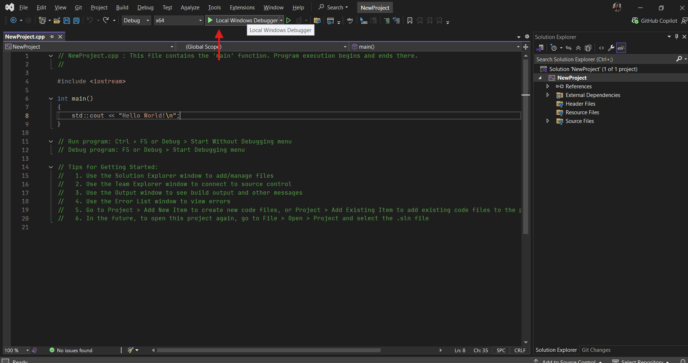

## 3. Създаване и качване на repository в Github

За да качите вашия код в repository в Github, отваряте вашия проект, кликвате бутона "Add to source control" и след това избирате "Git"

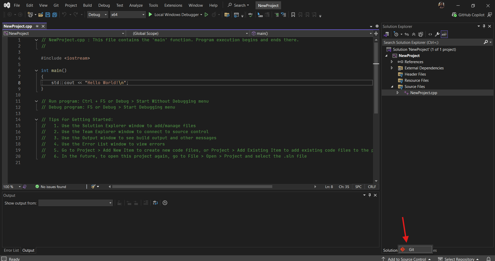

След като ви излезе прозорецът, има няколко неща, които ви интересуват:
1. Може да добавите README.md файл, който се визуализира на страницата на repository-то ви в Github. В него може да опишете за кое упражнение (номер/тема) са дадените задачи например. В него може да пишете директно през сайта на Github (не е задължително да имате такъв файл). 

2. Трябва да сте си добавили Github профила във Visual Studio. Може да го направите при инсталация (последната стъпка от [тази](#1-инсталация) част на tutorial-а) или от прозореца, който е отворен сега.

3. Добавете име на вашето repository

4. Добавете описание на вашето repository (не е задължително)

5. **Най-важната част е да направите "Visibility"-то на "Public". В противен случай никой няма да може да достъпва страницата на repository-то, освен вас!**

Накрая просто кликвате "Create and Push"!

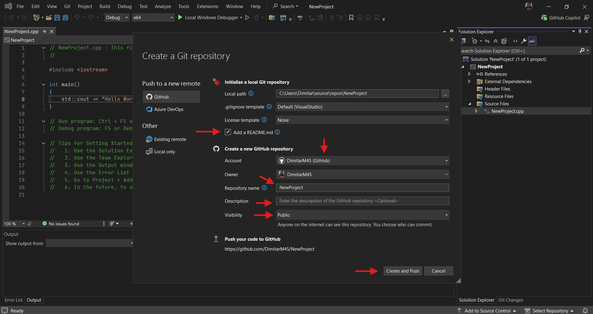

След като се качи repository-то, може да го достъпите от страницата на вашия профил -> "Repositories".

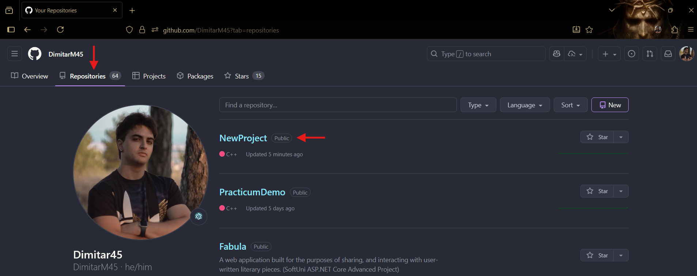

В страницата на вашето repository се намират файловете, който сте качили през Visual Studio. Вдясно може да видите и промените (ако желаете) description-а, а най-отдолу се вижда и README.md файлът (може да го редактирате като кликнете моливчето).

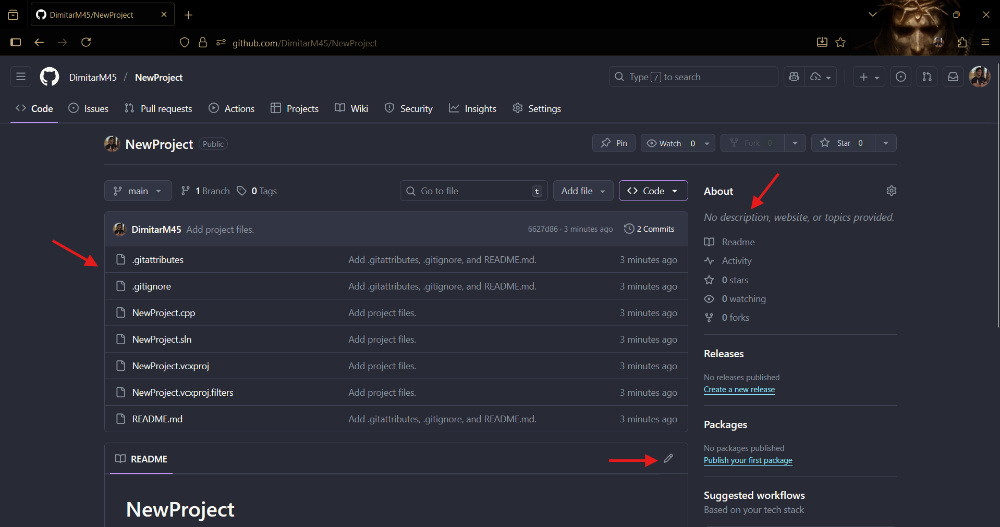

**Ако нямате опит с git ви препоръчваме да качвате вашите repository-та СЛЕД като сте си решили задачите (т.е., когато няма да редактирате файловете повече), за да не се занимавате с commit-и.**

**За да ни изпратите кода си, просто копирате линка на страницата на вашето repository и ни го изпращате на лично съобщение.**

**За тези, на които им е по-трудно с Github repository-та има и [gist tutorial](../../Gist/Gist-tutorial.md)!**

Разбира се, ако имате нужда от помощ винаги сме насреща! :)

