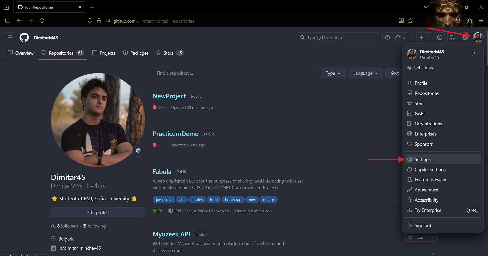
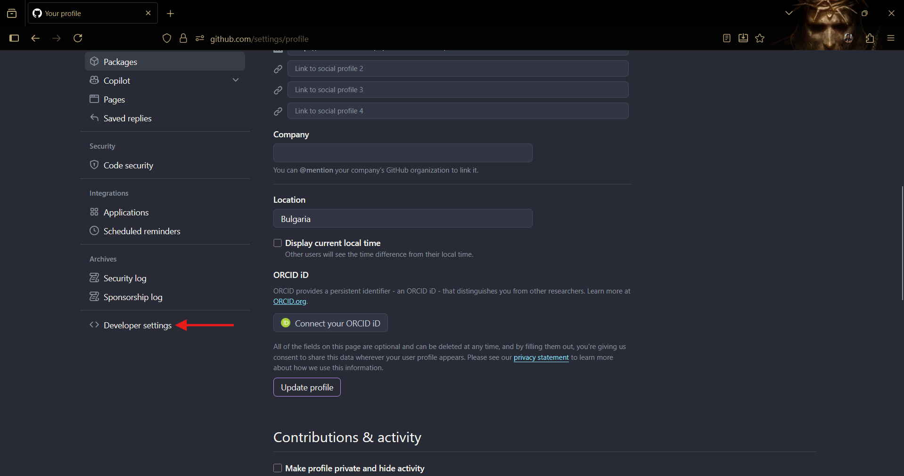
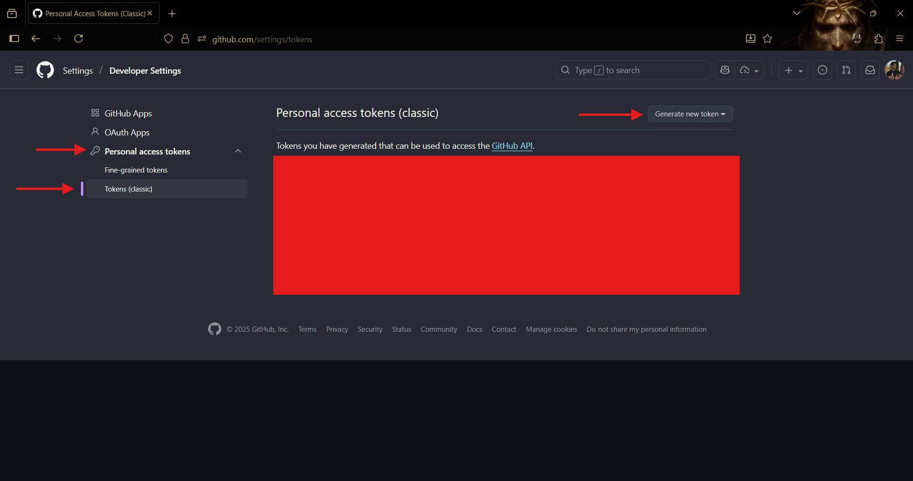

# Работа с XCode (Mac only)
**С Велислав сме на Windows, така че оставяме линкове с инструкции долу :d**
## 1. Инсталация и създаване на файл/проект

https://youtu.be/F6QZ2atZrDw

## 2. Създаване и качване на repository в Github

https://www.youtube.com/watch?v=OfLSJZwMCp8

**ВАЖНО: TOKEN-ЪТ, КОЙТО ГЕНЕРИРАТЕ ДОКАТО СЛЕДВАТЕ ИНСТРУКЦИИТЕ, Е ПАРОЛА! НЕ ГО ПОКАЗВАЙТЕ НА НИКОГО!**

**ВАЖНО 2.0: АКО ИСКАТЕ ДА ВИЖДАМЕ ВАШЕТО REPOSITORY, КОГАТО НИ ИЗПРАТИТЕ ЛИНК, НАПРАВЕТЕ ГО "PUBLIC", А НЕ "PRIVATE" КАКТО Е ПОКАЗАНО ВЪВ ВИДЕОТО!**

Как да стигнем до страницата за генериране на token-и:

Скролвате и кликвате "Developer settings".

След това избирате "Personal access tokens". Там ще намерите "Tokens (classic)", след което кликвате "Generate new token" и следвате инструкциите от видеото.

**За да ни изпратите кода си, просто копирате линка на страницата на вашето repository и ни го изпращате на лично съобщение.**

**За тези, на които им е по-трудно с Github repository-та има и [gist tutorial](../../Gist/Gist-tutorial.md)!**

Разбира се, ако имате нужда от помощ винаги сме насреща! :)